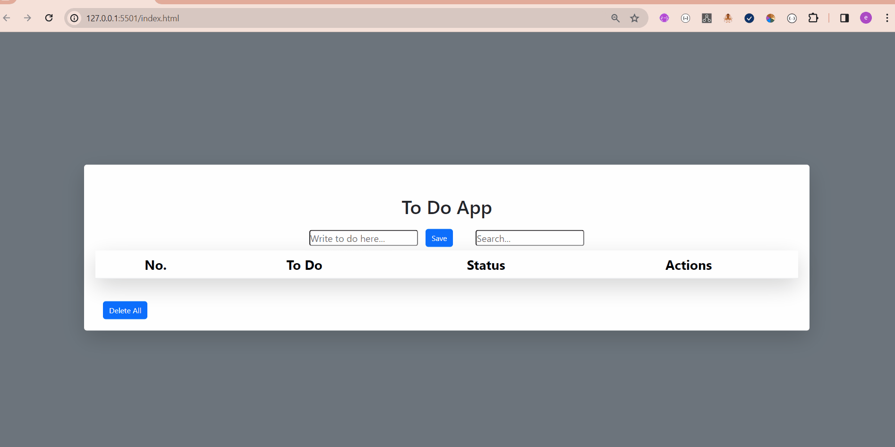

##My to do project

To Do App

At this app,js is used to add,filter and delete to manage the items,also getted and setted items to localstorage.This is an moduler app that you can manage functions one by one easily.

